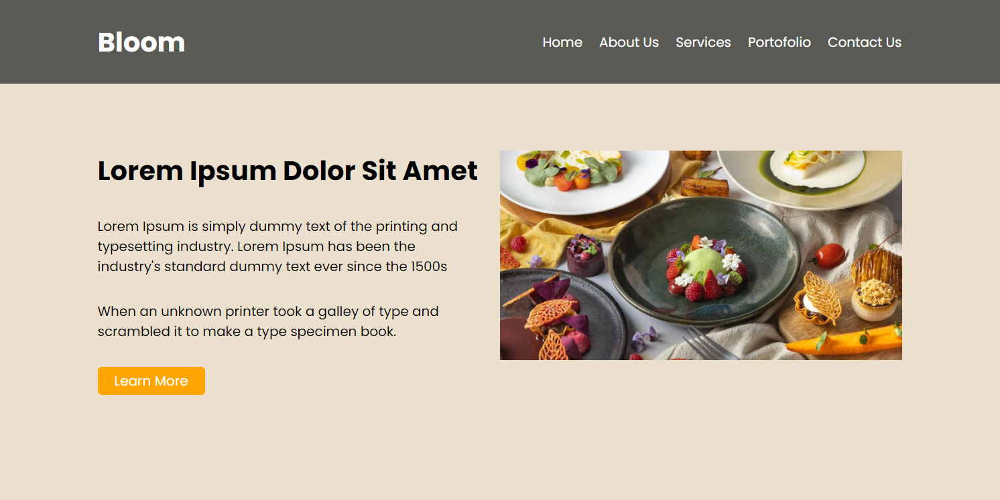
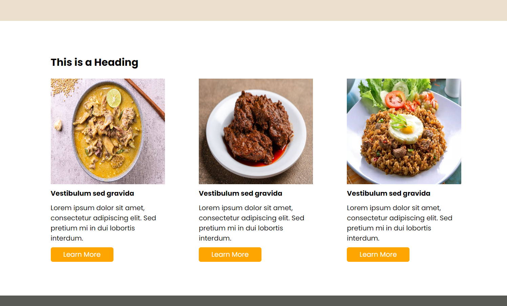
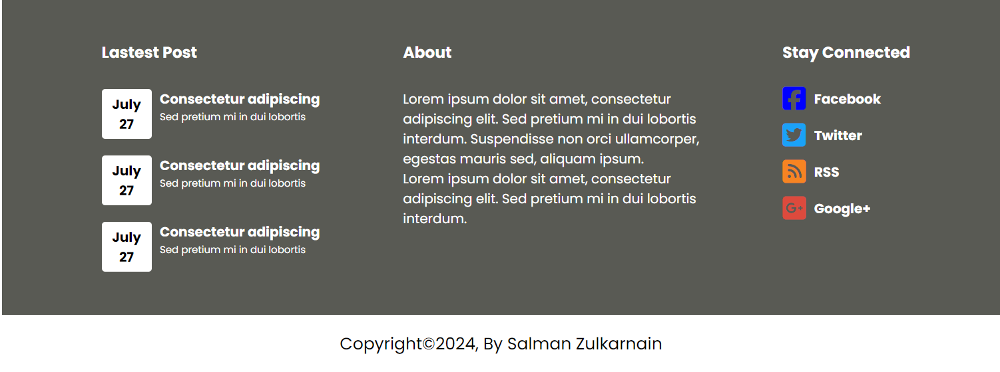

# LAYOUT WEBSITE BLOOM

**Layout Website Bloom** adalah desain antarmuka pengguna yang menampilkan tata letak modern, cocok untuk berbagai jenis website, seperti portofolio, blog, atau situs bisnis. Layout ini mengedepankan estetika yang bersih dan fungsional, memungkinkan pengguna untuk mengakses informasi dengan mudah.

## Fitur
- **Navigasi Sederhana**: Menu navigasi yang jelas dan mudah digunakan, memudahkan pengunjung untuk menemukan informasi yang mereka cari.
- **Section yang Terorganisir**: Tersedia beberapa section seperti hero banner, galeri, dan footer untuk menyajikan konten dengan cara yang menarik.
- **Penggunaan Warna yang Menarik**: Skema warna yang harmonis untuk menciptakan suasana yang menyenangkan dan nyaman saat menjelajahi situs.

## Cara Memakai
1. Salin file layout ke dalam folder proyek website kamu.
2. Sesuaikan konten di dalam section sesuai dengan kebutuhanmu (teks, gambar, dan link).
3. Implementasikan file CSS yang diperlukan untuk mendukung tampilan dan fungsi.

## Teknologi yang Digunakan
- HTML
- CSS

---

